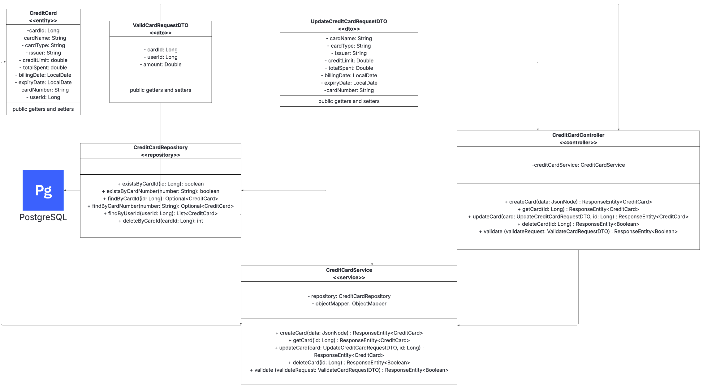

# Credit Card Service - FinalticaPro

The Credit Card Service is a standalone microservice within the FinalticaPro personal finance management platform. It is responsible for managing user-defined credit card accounts, performing transaction validations, and maintaining usage statistics.

---

## Overview

This service provides RESTful APIs to:
- Create and update credit card details
- Validate card usage against available credit limit
- Track cumulative spending per card
- Integrate with the Transaction Service for spending authorization
- Allow users full control over their registered credit card records

---

## Endpoints

| HTTP Method | Endpoint                            | Description                                |
|-------------|-------------------------------------|--------------------------------------------|
| POST        | `/credit-cards`                     | Create a new credit card                   |
| GET         | `/credit-cards/{id}`                | Retrieve card details by ID                |
| PUT         | `/credit-cards/{id}/name`           | Update the card's name                     |
| PUT         | `/credit-cards/{id}/type`           | Update the card's type                     |
| PUT         | `/credit-cards/{id}/issuer`         | Update the card's issuer                   |
| PUT         | `/credit-cards/{id}/limit`          | Update the card's credit limit             |
| PUT         | `/credit-cards/{id}/billing-date`   | Update the billing date                    |
| PUT         | `/credit-cards/{id}/expiry-date`    | Update the expiry date                     |
| PUT         | `/credit-cards/{id}/card-number`    | Update the last 4 digits of the card       |
| POST        | `/credit-cards/validate`            | Validate a transaction against a card      |
| POST        | `/credit-cards/{id}/record-usage`   | Record usage after successful transaction  |
| DELETE      | `/credit-cards/{id}`                | Delete a credit card                       |

---

## Method Reference

### createCard(JsonNode card): CreditCard  
Creates a new credit card entry using user-provided details.

### getCardById(Long cardId): CreditCard  
Retrieves the credit card information for a given ID.

### updateCardName(String name, Long id): CreditCard  
Updates the display name of the credit card.

### updateCardType(String type, Long id): CreditCard  
Updates the type of the credit card (e.g., Credit, Virtual).

### updateIssuer(String issuer, Long id): CreditCard  
Updates the card issuer (e.g., ICICI, HDFC).

### updateCreditLimit(double limit, Long id): CreditCard  
Modifies the card's maximum credit limit.

### updateBillingDate(LocalDate billingDate, Long id): CreditCard  
Changes the billing cycle anchor date.

### updateExpiryDate(LocalDate expiryDate, Long id): CreditCard  
Updates the expiry date of the card.

### updateCardNumber(String digits, Long id): CreditCard  
Stores the last 4 digits of the credit card number.

### validateTransaction(Long userId, Long cardId, double amount): boolean  
Checks if a transaction is allowed based on available balance and ownership.

### recordUsage(Long cardId, double amount): void  
Increases the totalSpent after a successful card-based transaction.

### deleteCard(Long cardId): void  
Removes the credit card record permanently.

---

## Architecture Diagram

> Architecture diagram showing how the components of credit-card-service will interact with each other

---

## Notes

- All card number handling must store only the last four digits.
- Credit limit enforcement is handled internally before usage is recorded.
- This service does not directly store or access User details — `userId` is passed from external services.
